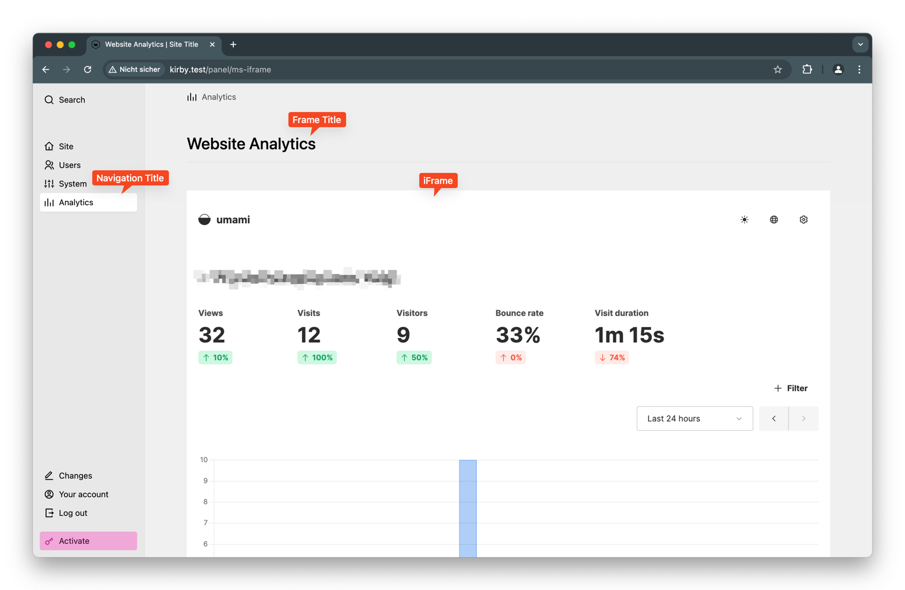
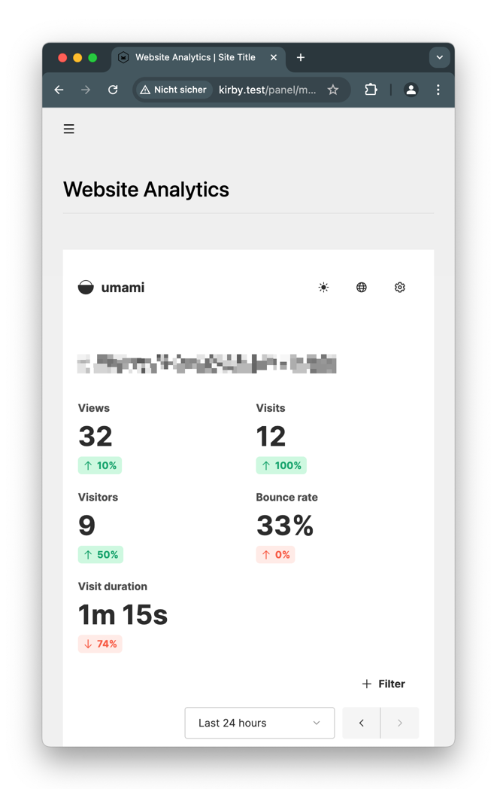

# kirby-iframe
Plugin to add an iFrame to Kirby Panel. 



## Installation
```
composer require msenkpiel/kirby-iframe
```

## Config options

Due to the iframe security policies, it is not possible to read the height of the iFrame content and embed the frame at the appropriate height. Therefore, you can only define fixed heights for the iFrame. To ensure responsive behavior, it is possible to define breakpoints and corresponding iFrame heights.



### Config

```php
// site/config/config.php
return [
    'msenkpiel.iframe' = [
        
         // panel navigation settings
        'label' => 'Navigation Label',
        'icon' => 'box',
        
        // panel frame title
        'title' => 'Frame title',
        
        // iframe url
        'url' => '',
        
        // iframe height based on container width
        'breakpoints' => [
            0 => 500, // mobile
            992 => 3000 // desktop
        ]
    ]
]
```

