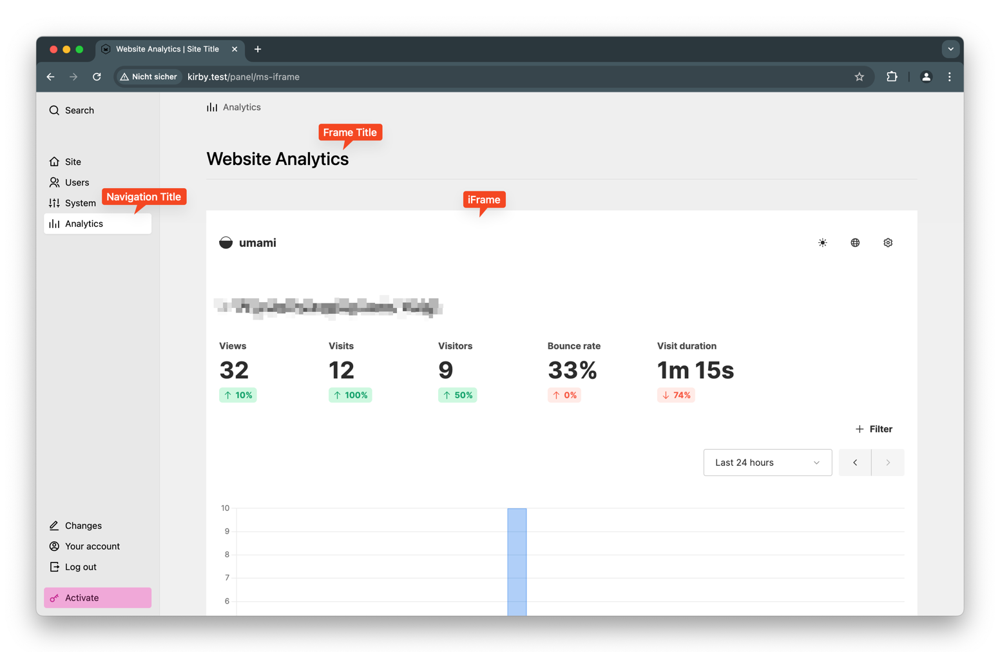
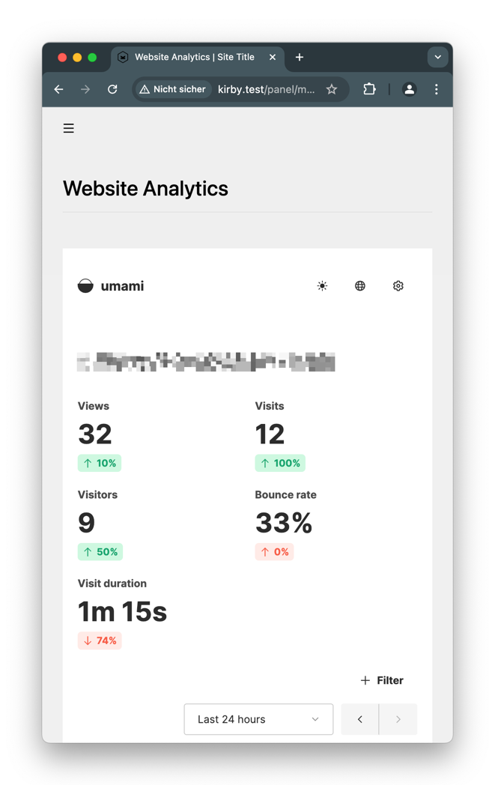

# kirby-iframe
Plugin to add an iFrame to Kirby Panel. 



## Installation
```
composer require msenkpiel/kirby-iframe
```

## Config options

Due to the iframe security policies, it is not possible to read the height of the iFrame content and embed the frame at the appropriate height. Therefore, you can only define fixed heights for the iFrame. To ensure responsive behavior, it is possible to define breakpoints and corresponding iFrame heights.



### Config

```php
// site/config/config.php
return [
    'msenkpiel.iframe' => [
        
         // panel navigation settings
        'label' => 'Navigation Label',
        'icon' => 'box',
        
        // panel frame title
        'title' => 'Frame title',
        
        // iframe url
        'url' => '',
        
        // iframe height based on container width
        'breakpoints' => [
            0 => 500, // mobile
            992 => 3000 // desktop
        ]
    ]
]
```

## Development

You can test the plugin locally without installing Kirby on your machine. The
Docker setup creates a temporary Kirby Plainkit installation, mounts this plugin
into `site/plugins/kirby-iframe` and starts Kirby's built-in PHP server.

### Docker test environment

```sh
docker compose up --build
```

- Website: <http://localhost:8080>
- Panel: <http://localhost:8080/panel>
- Login: `admin@example.test` / `admin1234`

The default Panel account is only intended for this local test environment. You
can override the credentials and iframe URL with environment variables:

```sh
KIRBY_ADMIN_EMAIL=admin@example.test KIRBY_ADMIN_PASSWORD=admin1234 IFRAME_URL=/iframe-target docker compose up --build
```

To use a different host port:

```sh
KIRBY_PORT=8081 docker compose up --build
```

To remove the temporary Kirby installation and start fresh:

```sh
docker compose down -v
```

### Run Kirby-Up

The Panel view is built from a Vue component with kirbyup.

```sh
npm install
npm run dev
npm run build
```
